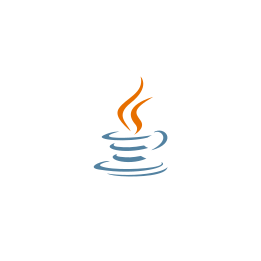
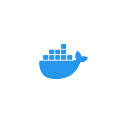
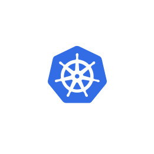
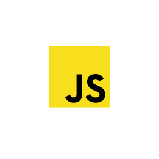
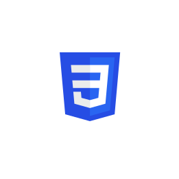

### Hi there 👋, I'm Satish Ahirwar ![]
## I am Backend Developer

- 🌍 I'm based in Pune, India
- 🖥️ See my portfolio at <a target="_blank" rel="noreferrer" href=''>Portfolio</a>
- 🧠 Currently learning React JS
   

### Skills

#### Backend

#### Frontend

 Thanks !!!
